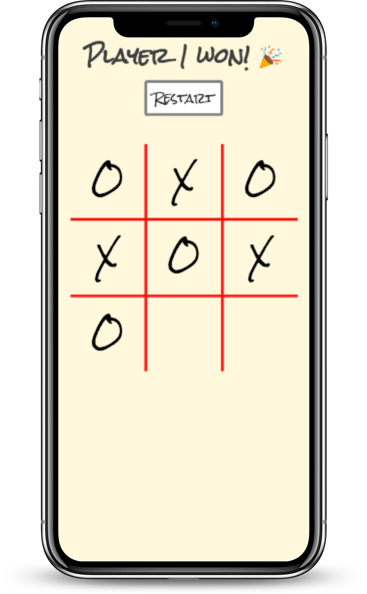

<!--
*** Thanks for checking out this README Template. If you have a suggestion that would
*** make this better, please fork the repo and create a pull request or simply open
*** an issue with the tag "enhancement".
*** Thanks again! Now go create something AMAZING! :D
-->

<!-- PROJECT SHIELDS -->
<!--
*** I'm using markdown "reference style" links for readability.
*** Reference links are enclosed in brackets [ ] instead of parentheses ( ).
*** See the bottom of this document for the declaration of the reference variables
*** for contributors-url, forks-url, etc. This is an optional, concise syntax you may use.
*** https://www.markdownguide.org/basic-syntax/#reference-style-links
-->
[![Contributors][contributors-shield]][contributors-url]
[![Forks][forks-shield]][forks-url]
[![Stargazers][stars-shield]][stars-url]
[![Issues][issues-shield]][issues-url]


<!-- PROJECT LOGO -->
<br />
<p align="center">
  <a href="https://github.com/vzdrizhni/Tic-tac-toe_JS">
    
  </a>

  <h3 align="center">JavaScript --> [Tic Tac Toe]</h3>

  <p align="center">
    This project is part of the Microverse curriculum in JavaScript module!
    <br />
    <a href="https://github.com/vzdrizhni/Tic-tac-toe_JS"><strong>Explore the docs »</strong></a>
    <br />
    <br />
    <a href="https://github.com/vzdrizhni/Tic-tac-toe_JS/issues">Report Bug</a>
    ·
    <a href="https://github.com/vzdrizhni/Tic-tac-toe_JS/issues">Request Feature</a>

  </p>
</p>

<!-- TABLE OF CONTENTS -->
## Table of Contents

* [About the Project](#about-the-project)
  * [Built With](#built-with)
  * [Usage](#usage)
  * [Automated Test](#automated-test)
* [Contributors](#contributors)
* [Acknowledgements](#acknowledgements)
* [License](#license)

<!-- ABOUT THE PROJECT -->
## About The Project

In this project, the student builds a Tic Tac Toe game (Again) but this time it’ll be rendered in the browser. No backend. This project follows the lesson about Factory Functions and The Module Pattern so the main goal is to put into practice those concepts along with the main concepts of Object Oriented Programming. Particularly, classes/objects and how to access their methods and attributes.

<p float="left" align="center">
  
   
</p>

### Built With
This project was built using these technologies.
* HTML/CSS
* JavaScript
* ESLint
* StyleLint
* GithubActions :muscle:
* Atom :atom:
* VSCode :vs:

<!-- INSTALLATION -->
## Usage

To have this app on your pc, you need to:
* have Ruby & Ruby on Rails installed in your computer
* [download](https://github.com/vzdrizhni/Tic-tac-toe_JS/archive/develop.zip) or clone this repo:
  - Clone with SSH:
  ```
    git@github.com:vzdrizhni/Tic-tac-toe_JS.git
  ```
  - Clone with HTTPS
  ```
    https://github.com/vzdrizhni/Tic-tac-toe_JS.git
  ```
- and open ```index.html``` file with a browser of your choice.

## Automated Test
 > No automated tests yet

## Live Demo

[Live Demo](https://rammazzoti2000.github.io/Tic-tac-toe_JS/) :point_left:

<!-- CONTACT -->
## Contributors

👤 **Roman Nikolaev**

- LinkedIn: [Roman Nikolaev](https://www.linkedin.com/in/roman-nikolaev-65b639197/) -
- GitHub: [@vzdrizhni](https://github.com/vzdrizhni)
- E-mail: vzdrizhni@gmail.com

👤 **Alexandru Bangau**

- LinkedIn: [Alexandru Bangau](https://www.linkedin.com/in/alexandru-bangau/)
- GitHub: [@rammazzoti2000](https://github.com/rammazzoti2000)
- E-mail: bangau.alexandru@gmail.com

## :handshake: Contributing

Contributions, issues and feature requests are welcome!

Feel free to check the [issues page](https://github.com/vzdrizhni/Tic-tac-toe_JS/issues).

## Show your support

Give a :star: if you like this project!


<!-- ACKNOWLEDGEMENTS -->
## Acknowledgements
* [Microverse](https://www.microverse.org/)
* [The Odin Project](https://www.theodinproject.com/)

<!-- MARKDOWN LINKS & IMAGES -->
<!-- https://www.markdownguide.org/basic-syntax/#reference-style-links -->
[contributors-shield]: https://img.shields.io/github/contributors/vzdrizhni/Tic-tac-toe_JS.svg?style=flat-square
[contributors-url]: https://github.com/vzdrizhni/Tic-tac-toe_JS/graphs/contributors
[forks-shield]: https://img.shields.io/github/forks/vzdrizhni/Tic-tac-toe_JS.svg?style=flat-square
[forks-url]: https://github.com/vzdrizhni/Tic-tac-toe_JS/network/members
[stars-shield]: https://img.shields.io/github/stars/vzdrizhni/Tic-tac-toe_JS.svg?style=flat-square
[stars-url]: https://github.com/vzdrizhni/Tic-tac-toe_JS/stargazers
[issues-shield]: https://img.shields.io/github/issues/vzdrizhni/Tic-tac-toe_JS.svg?style=flat-square
[issues-url]: https://github.com/vzdrizhni/Tic-tac-toe_JS/issues

## 📝 License

This project is [MIT](https://opensource.org/licenses/MIT) licensed.
